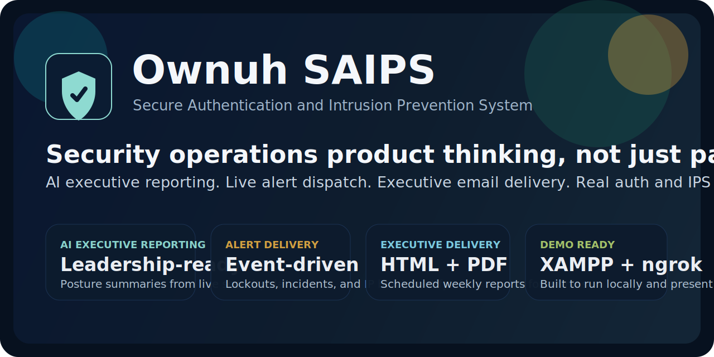
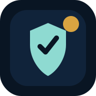
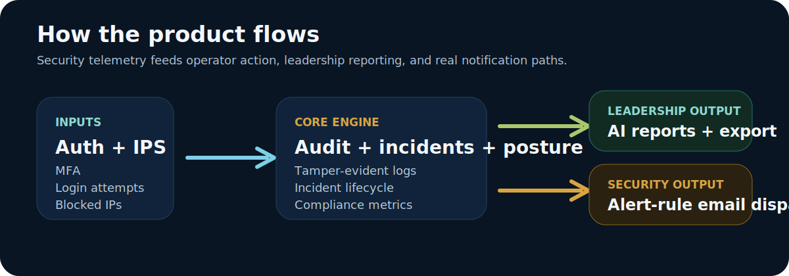
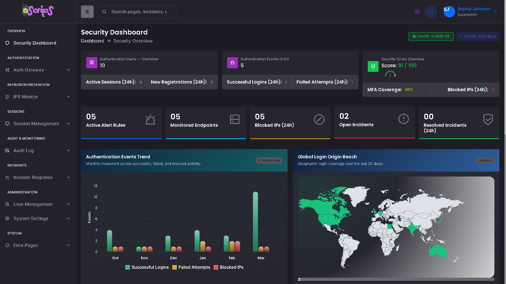
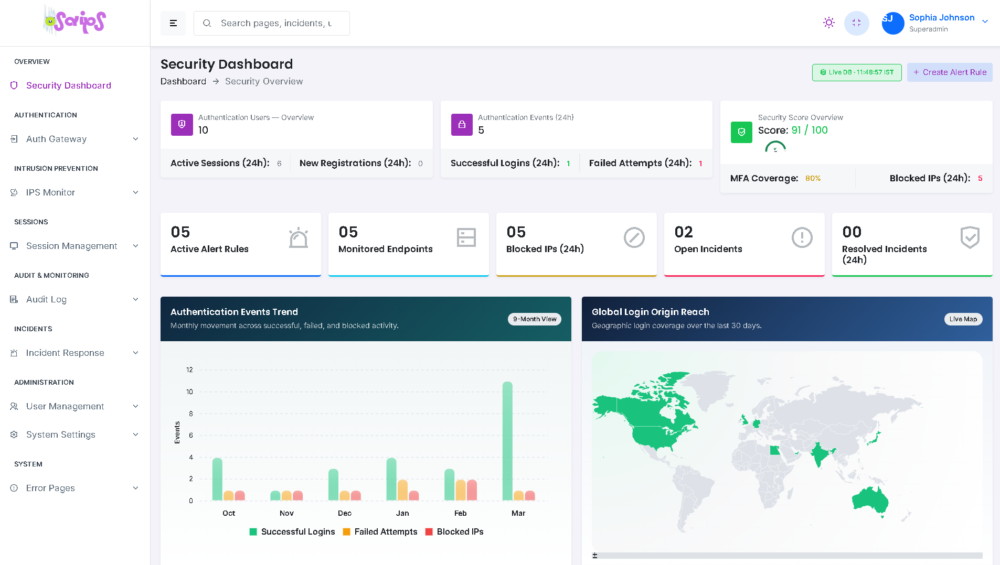
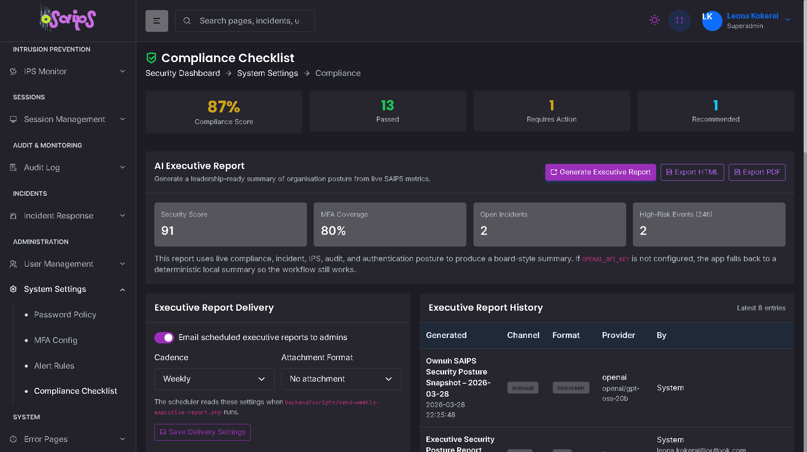
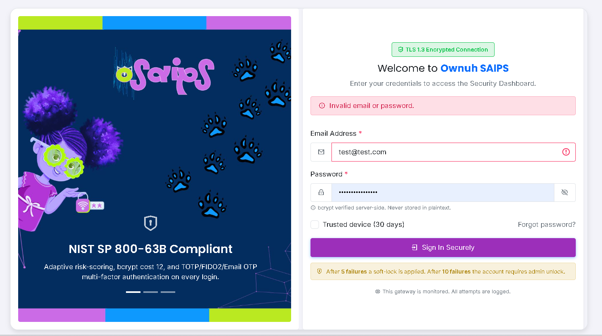

# Ownuh SAIPS - Secure Authentication & Intrusion Prevention System

<p align="center">
  
</p>

<p align="center">
  
</p>

<p align="center">
  <strong>Security operations product thinking, built in PHP.</strong><br>
  AI executive reporting, live alert dispatch, executive email delivery, and demo-ready auth + IPS workflows.
</p>

<p align="center">
  
  
  
  
</p>

<p align="center">
  
  
  
  
</p>

**Version:** 1.2.0  
**Classification:** CONFIDENTIAL  
**Effective:** March 2026

> CAP512 - PHP & MySQL for Dynamic Web Applications  
> BSc (Hons) Computer Science & Cyber Security - Lovely Professional University - 2026

---

## Overview

Ownuh SAIPS is a full-stack security administration platform built with PHP, MySQL, Bootstrap, and Redis-backed security controls. It simulates a real SOC-style environment with authentication, MFA, password recovery, intrusion prevention, audit logging, session management, and compliance reporting.

This is not just a login screen with a dashboard bolted on. It is designed to feel like a compact security operations product: analysts get incident and IPS visibility, admins get strong auth controls, and leadership gets executive-ready posture reporting without needing to read raw logs.

It now also includes executive-facing AI reporting, downloadable posture exports, scheduled leadership updates, real alert-driven email notifications, and a cleaner shared-layout UI layer across the PHP application.

**Compliance targets:** NIST SP 800-63B, OWASP Top 10, ISO/IEC 27001, GDPR Article 33, SOC 2 Type II

---

## Why It Lands Well In A Demo

- It shows both defensive depth and product thinking: auth, MFA, lockouts, IPS, audit, incidents, and compliance all connect instead of living as isolated pages
- It gives leadership-facing output, not just engineer-facing telemetry, through AI executive summaries, exportable reports, and scheduled email briefings
- It behaves like an opinionated security product: alerts can actually notify, incidents can be tracked, and admin actions leave an audit trail
- It is practical to run locally with XAMPP, but polished enough to show publicly through ngrok

---

## Visual Product Flow

<p align="center">
  
</p>

---

## Screenshots

### Main Dashboard

<p align="center">
  
</p>

The main dashboard is designed to feel like an actual operator workspace. The first screen brings KPIs, authentication trends, geographic login reach, and live security workflow signals together before you ever drill into a table.

### Dashboard In Light Mode

<p align="center">
  
</p>

The light theme keeps the same structure and pacing for demos where brighter screenshots read better in portfolios, reports, or presentations.

### Executive Reporting And Compliance

<p align="center">
  
</p>

This is where the platform broadens from operator tooling into leadership-ready output: live compliance posture, AI executive reporting, export controls, delivery settings, and report history all sit in one place.

### Sign-In Experience

<p align="center">
  
</p>

The sign-in screen sets the tone early. It is still security-first, but the product presentation is deliberate enough that the app feels cohesive before the user even enters the dashboard.

## Quick Start

### 1. Install

Choose the setup path that matches your environment.

#### Windows / XAMPP

```powershell
cd C:\xampp\htdocs\ownuh_saips_fixed
Set-ExecutionPolicy -Scope Process Bypass
.\setup_windows.ps1
```

Or:

```bat
cd C:\xampp\htdocs\ownuh_saips_fixed
setup_windows.bat
```

The Windows setup script:
- creates `ownuh_saips` and `ownuh_credentials`
- imports schema and the recruiter-friendly `portfolio_seed.sql`
- generates JWT keys in `keys/`
- writes `backend/config/.env`
- prints the live demo login and app URL

#### Linux / macOS

```bash
git clone https://github.com/YOUR_USERNAME/ownuh-saips.git
cd ownuh-saips
bash install.sh
```

The Linux setup script:
- creates `ownuh_saips` and `ownuh_credentials`
- imports schema and the recruiter-friendly `portfolio_seed.sql`
- generates JWT keys in `keys/`
- writes `backend/config/.env`
- prints the live demo login and app URL

### 2. Start the app

```bash
php -S 0.0.0.0:8080
```

Or serve it with XAMPP/Apache from:

```text
C:\xampp\htdocs\ownuh_saips_fixed
```

### 3. Open in browser

```text
# PHP built-in server
http://localhost:8080/login.php

# XAMPP / Apache
http://localhost/ownuh_saips_fixed/login.php
```

### 4. Seed users

| Email | Password | Role |
|---|---|---|
| `lucia.alvarez@ownuh-saips.com` | `Admin@SAIPS2025!` | Admin |
| `sophia.johnson@ownuh-saips.com` | `Admin@SAIPS2025!` | Super Admin |
| `marcus.chen@ownuh-saips.com` | `Admin@SAIPS2025!` | Admin |

Change all seed passwords immediately after first login.

The default scripted install now uses `database/portfolio_seed.sql` so the app comes up with fuller dashboard, IPS, incident, audit, and MFA demo data.

---

## ngrok

Use ngrok when you need a public HTTPS demo URL.

### Built-in PHP server

```bash
php -S 0.0.0.0:8080
ngrok http 8080
```

Open:

```text
https://YOUR-SUBDOMAIN.ngrok-free.app/login.php
```

### XAMPP / Apache

```bash
ngrok http 80
```

Open:

```text
https://YOUR-SUBDOMAIN.ngrok-free.app/ownuh_saips_fixed/login.php
```

### Required `.env` values for ngrok

```env
APP_URL=https://YOUR-SUBDOMAIN.ngrok-free.app
TRUSTED_PROXY=any
COOKIE_SAMESITE=Lax
APP_TIMEZONE=Asia/Kolkata
APP_TIMEZONE_LABEL=IST
```

`TRUSTED_PROXY=any` allows the app to trust ngrok's forwarded HTTPS headers.  
`COOKIE_SAMESITE=Lax` prevents login/session breakage through the tunnel.

---

## Feature Highlights

### Security Core

- RS256 JWT authentication with secure cookie/session handling
- MFA flows with TOTP, email OTP, backup codes, and admin-issued bypass tokens
- Self-service password reset with token confirmation and session revocation
- Authenticated password-change page using the create-password UI
- Tamper-evident audit logging with direct-table fallback if the stored procedure is absent
- IPS modules for brute-force visibility, blocked IP management, geo rules, and rate-limit configuration
- Session tracking and revocation
- Incident tracking and compliance views

### AI And Executive Reporting

- AI-generated executive posture reporting from live compliance and security metrics
- OpenAI-compatible AI provider support for executive posture reporting, including Groq via `OPENAI_BASE_URL`
- Executive report export in browser-friendly HTML and printable PDF
- Scheduled weekly executive report emails to active admins and superadmins
- Stored executive report history with cadence and attachment preferences

### Alerting And Operator Experience

- Event-driven email alerts for account lockouts, blocked IPs, repeated failed logins, and incident activity
- Global header search, synchronized dark-mode sidebar styling, and fullscreen support
- Shared PHP header, sidebar, mobile menu, and footer-script partials for easier maintenance
- Shared-shell PHP replacements for auth, error, maintenance, offline, and signup utility pages
- IST-based application time defaults via environment configuration

---

## Recent Security Features

- `forgot-password.php` + `reset-password.php` + `backend/api/auth/reset-confirm.php` now form a working self-service password reset flow
- `auth-create-password.php` provides the polished password UI for authenticated password changes
- `users.php` can issue MFA bypass tokens and `otp-verify.php` can consume them once for recovery
- Audit writes no longer fail locally when `sp_insert_audit_log` is missing
- IPS pages now match the current database schema and failed login attempts are recorded for brute-force reporting
- Timestamps and dashboard clocks now display as IST by default
- `settings-compliance.php` can generate an AI executive report summarizing organisation posture
- `executive-report-export.php` exports the executive report as HTML or PDF
- `backend/scripts/send-weekly-executive-report.php` can email a weekly posture brief to admins
- Executive reporting now stores history entries for manual generation, exports, and scheduled email runs
- The alert-rule pipeline now dispatches real email notifications for wired security and incident events instead of acting as UI-only configuration
- Shared layout partials now drive the main PHP shell so header, menu, and footer behavior stay consistent
- Header search, fullscreen handling, and dark-mode menu behavior are now unified across the app

---

## What Feels Good About This Build

- It takes security UX seriously instead of hiding behind raw backend claims
- The AI features are constrained and useful: they summarize posture for decision-makers rather than pretending to auto-run security
- Email is not just decorative in the settings table anymore; weekly reports and wired alert events actually send
- The app now has enough shared layout structure that new screens can be added without copy-pasting headers and footers everywhere

---

## Important Pages

- `login.php` - sign in
- `forgot-password.php` - request reset link
- `reset-password.php` - token-based password reset UI
- `auth-create-password.php` - authenticated password change UI
- `otp-verify.php` - MFA verification and bypass-token recovery
- `users.php` - user management and MFA bypass issuance
- `settings-compliance.php` - compliance posture plus AI executive reporting
- `executive-report-export.php` - HTML/PDF export endpoint for executive reports
- `auth-signup.php` - shared-shell signup flow using the live registration API
- `auth-401.php`, `auth-404.php`, `auth-500.php`, `under-maintenance.php` - shared-shell utility/error pages
- `ips-blocked-ips.php` - blocked IP administration
- `ips-brute-force.php` - brute-force monitoring
- `ips-geo-block.php` - geo rule management
- `dashboard.php` - live security dashboard

---

## Security Notes

- Password hashes are isolated in `ownuh_credentials`
- CSRF tokens are used on state-changing browser flows
- JWT keys are generated locally and should stay out of git
- Session cookies adapt correctly for direct localhost vs ngrok/reverse-proxy use
- Password history and similarity checks are enforced on both reset and change flows
- AI reporting uses structured outputs and can fall back to a deterministic local executive summary when no OpenAI API key is configured
- AI reporting can be pointed at OpenAI-compatible providers such as Groq by setting `OPENAI_BASE_URL`
- Executive-report emails render as HTML and can attach the generated report as PDF
- Alert rules are now live event-to-email notifications for the wired auth, IPS, and incident event codes
- Historical audit entries are not rewritten by email-domain migrations, preserving tamper-evident hash integrity

---

## Changelog

### v1.2.0 (March 2026)

- Added AI executive reporting for organisation posture on the compliance screen
- Added HTML and PDF export for executive posture reports
- Added scheduled weekly executive-report emails for admins and superadmins
- Added stored executive-report history plus cadence and attachment settings
- Added OpenAI-compatible AI provider support through configurable base URL and model settings
- Added live alert dispatch for wired auth, IPS, and incident event codes
- Added global header search and improved fullscreen/theme behavior
- Refactored shared PHP layout partials for header, menu, mobile menu, and footer scripts
- Replaced remaining static auth/error utility screens with shared-shell PHP pages and redirect stubs
- Added live password-change page using the create-password UI
- Upgraded reset-password page to the same password UI shell
- Fixed password-reset links for `/ownuh_saips_fixed/` deployments
- Fixed reset confirmation lookup issues caused by mixed collations
- Added MFA bypass issuance and one-time recovery consumption
- Added audit fallback when the stored procedure is missing
- Fixed IPS modules to align with current schema and login-attempt tracking
- Switched app display time defaults to IST

### v1.1.0 (March 2026)

- Fixed JWT base64url handling end to end
- Fixed `require_auth()` redirect flow
- Fixed credentials DB env handling
- Added `logout.php`
- Added installer and Apache setup scripts

---

## Deployment

See [DEPLOYMENT.md](DEPLOYMENT.md) for:
- GitHub push steps
- Windows and Linux scripted setup options
- ngrok exposure
- Apache/Linux deployment
- environment variables
- security checklist

Also see:
- `ARCHITECTURE.md` for component boundaries and auth/MFA/reset design
- `KNOWN_LIMITATIONS.md` for honest demo-vs-production tradeoffs
